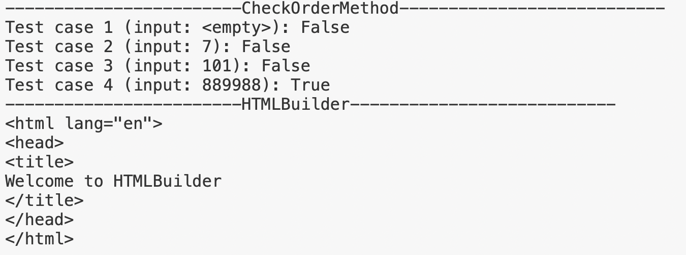

# HTMLBuilder and Check Order Method

> HtmlBuilder allows you to writing HTML by C# code.

> Check Order Method allows you to check integer pairs [0-9].

---

## OUTPUT 🖨:

> [▶️To run the program](https://paiza.io/projects/e/PBDSK-PD_yWy3VNvRsNTTw?theme=twilight)

---

##Group information:
**Instructor:Fai Alotaibi** 👩‍🏫

 **Group Name: The Rea sea Project** 🌊
